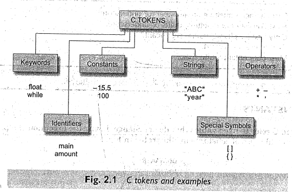
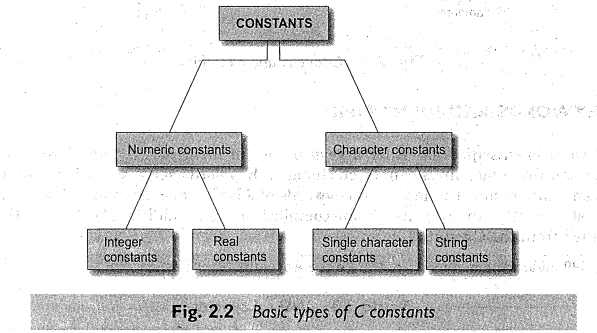

# 1.1 The #include directive

C programs are divided into modules or functions. Some functions are written by users, like us, and many others are stored in the C library.
Library functions are grouped category-wise and stored in different files known as header files.

If we want to access the functions stored in the library, it is necessary to tell the compiler about the files to be accessed

This is achieved by using the preprocessor directive __#include__ as follows:
```c 
#include <filename>
```

_filename_ is the name of the library file that contains the required function definition. Preprocessor directives are placed at the beginning of a program.

# 1.2 C Tokens

In a passage of text, individual words and punctuation marks are called tokens. Similarly, in a C program the smallest individual units are known as C tokens. C has six types of tokens:



# 1.3 Keywords and Identifiers

Every C word is classified as either keyword or an identifier.

All keywords have fixed meanings and these meanings cannot be changed. Keywords serve as basic building blocks for program statements. All keywords must be written in lowercase. The list of all keywords of ANSI C are listed in the figure below


Identifiers refer to the names of variables, functions and arrays. These are user-defined names and consist of a sequence of letters and digits, with a letter as a first character. Both uppercase and lowercase letters are permitted, although lowercase letters are commonly used. The underscore character character is also permitted in identifiers.

## Rules for Identifiers

1. First character must be an alphabet (or underscore).
2. Must consist of only letters, digits or underscore.
3. Only first 31 characters are significant.
4. Cannot use a keyword.
5. Must not contain white space.


# 1.4 Constants

Constants in C refer to fixed values that do not change during the execution of a program. C supports several types of constants illustrated below



# 1.5 Variables

A variable is a data name that may be used to stare data value. Unlike constants that remain unchanged during the execution of the program, a variable may take different values at different times during execution. 

A variable name can be chosen by the programmer in a meaningful way so as to reflect its function or nature in the program. Some examples of such names are:

    Average
    height
    Total
    Counter_1
    class_strength

# 1.6 Data Types

ANSI C supports three classes of data types:
1. Primary (or fundamental) data types
2. Derived data types
3. User-defined data types